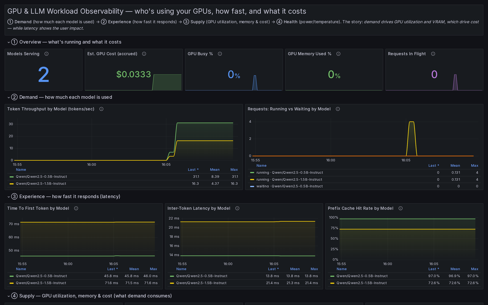
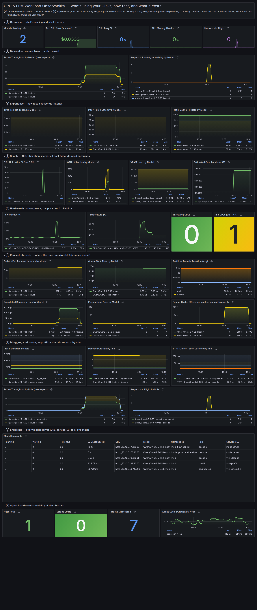

# gpu-llm-inferencing-workload-ops

**Know which model is actually burning your GPUs.**

Workload-aware GPU + inference observability for **vLLM** and **llm-d** on
**Kubernetes**. One lightweight agent per node fuses NVIDIA hardware telemetry,
vLLM serving metrics, and llm-d routing metrics — then attributes every number
to the **model, pod, and role** responsible for it.

[](LICENSE)




> The bundled executive Grafana dashboard — demand, latency, GPU supply and cost,
> each attributed to the model responsible. [See the full dashboard ↓](#dashboard)

---

## The problem

Standard GPU monitoring (DCGM exporter, `nvidia-smi`) tells you a GPU is 95% busy
and hot — and hands you a `gpu.uuid`. It **cannot** tell you *which model, team,
or request* is causing it. So you can't answer the questions that actually matter:

- Which model is consuming this GPU right now — and how much is it costing?
- Is that idle-but-allocated H100 wasting money?
- Why is p99 latency spiking — queueing, KV-cache pressure, or a cold prefix cache?
- In a disaggregated setup, how is work split between prefill and decode servers?

## What it does

It closes that gap by joining three telemetry layers that normally live in
separate silos, and labelling everything with **workload identity**:

| Layer | Source | Examples |
|---|---|---|
| **Hardware** | NVML (in-process) | utilization, VRAM, temperature, power, ECC, throttling — **per GPU and per model** |
| **Serving** | vLLM `/metrics` | TTFT, inter-token latency, e2e latency, queue time, prefill/decode duration, throughput, KV-cache %, prefix-cache hit rate, preemptions |
| **Routing** | llm-d EPP `/metrics` | scheduler decisions, pool KV-cache utilization, ready endpoints |
| **Identity** | Kubernetes API | `model`, `pod`, `namespace`, `service`, `role` (prefill/decode) |

Plus a simple **cost model** (`active GPU-seconds × $/hour`) attributed per model.

## Why it's different

- **Workload attribution is the headline, not an afterthought.** Every metric —
  hardware, serving, cost — carries the `model` it belongs to. Per-model **GPU
  utilization** and **VRAM** are derived from NVML per-process sampling, not guessed.
- **Inference-aware.** It understands modern serving: prefix caching, KV cache,
  and **disaggregated prefill/decode** (metrics broken out by role).
- **Multi-node-safe by design.** Each agent discovers and scrapes only the
  vLLM/EPP pods **on its own node** (by pod IP) — so a 1,000-node fleet never
  double-counts.
- **Vendor-neutral.** Emits Prometheus **and** OTLP. No backend is baked into the
  agent — push to Grafana Cloud, Datadog, a self-hosted Collector, or scrape locally.
- **Resilient.** Cost survives agent restarts (node-local persistence), the agent
  self-reports health, and every collector fails soft.

## Architecture

```
                       ┌──────────────── GPU node (DaemonSet) ─────────────────┐
 NVIDIA GPUs ─NVML────► │  nvml collector ─┐                                    │
 vLLM pods  ─/metrics─► │  vllm collector ─┼─► attribution join ─► exporters ─┬─┼─► Prometheus ──► Grafana
 llm-d EPP  ─/metrics─► │  llmd collector ─┘     (K8s API, by node)           └─┼─► OTLP push  ──► any backend
                       └───────────────────────────────────────────────────────┘
```

- **agent/** — Python DaemonSet: collectors → K8s attribution → Prometheus + OTLP exporters.
- **deploy/** — raw manifests **and** a Helm chart.
- **dashboards/** — a single executive Grafana dashboard (9 sections, top→bottom story).

---

## Install

### Option A — Helm (recommended)

```bash
helm install glwo deploy/helm/gpu-llm-inferencing-workload-ops -n monitoring --create-namespace \
  --set cluster=prod \
  --set agent.gpuHourlyUsd=2.50            # your GPU $/hour, for cost estimates

# push to an OTLP backend as well as local Prometheus:
#   --set otlp.enabled=true --set otlp.endpoint=https://otlp.example.io
# HA Prometheus + long-term storage:
#   --set prometheus.replicas=2 \
#   --set prometheus.remoteWrite[0].url=http://thanos-receive:19291/api/v1/receive
```

Grant scrape access to protected llm-d EPP metrics (optional):

```bash
helm upgrade glwo deploy/helm/gpu-llm-inferencing-workload-ops -n monitoring \
  --set eppMetricsAuth.enabled=true \
  --set 'eppMetricsAuth.serviceAccounts[0].name=flow-control-epp' \
  --set 'eppMetricsAuth.serviceAccounts[0].namespace=llm-d-flow-control'
```

### Option B — raw manifests

```bash
kubectl apply -f deploy/manifests/namespace.yaml
kubectl apply -f deploy/manifests/rbac.yaml
kubectl apply -f deploy/manifests/agent-daemonset.yaml
kubectl apply -f deploy/manifests/prometheus.yaml
bash   deploy/scripts/deploy-monitoring.sh   # Prometheus + Grafana + dashboard
```

### View it

```bash
kubectl port-forward -n monitoring svc/<release>-grafana 3000:3000
# open http://localhost:3000  (admin/admin) → "LLM Serving — Executive Overview"
```

---

<a name="dashboard"></a>

## The dashboard (one screen, read top → bottom)



*The full executive dashboard on a live cluster: two Qwen2.5 models served under
vLLM/llm-d, with per-model throughput, latency, GPU utilization, VRAM, cost, and
disaggregated prefill/decode timing.*

1. **Overview** — models serving, cost, GPU busy %, memory %, requests in flight
2. **Demand** — token throughput & queue depth per model
3. **Experience** — TTFT, inter-token latency, prefix-cache hit rate
4. **Supply** — GPU utilization (per-GPU **and per-model**), VRAM per model, cost per model
5. **Health** — power, temperature, throttling, idle GPUs
6. **Request lifecycle** — e2e latency, **prefill vs decode duration**, queue time, preemptions, cache efficiency
7. **Disaggregated serving** — prefill/decode timing & throughput **by model and role**
8. **Endpoints** — a table of every model server (model, namespace, service, role, URL, live stats)
9. **Agent health** — agents up, scrape errors, targets discovered, cycle duration

---

## Configuration (key flags / env)

| Flag / env | Default | Purpose |
|---|---|---|
| `--cluster` / `CLUSTER` | `default` | cluster label on all metrics |
| `--interval` / `INTERVAL` | `60` | collection interval (seconds) |
| `--gpu-hourly-usd` / `GPU_HOURLY_USD` | `0` | GPU $/hour for cost estimate |
| `--sink` / `SINK` | `prometheus` | `prometheus` \| `otlp` \| `both` \| `stdout` |
| discovery | on | auto-find vLLM/EPP pods on this node (`--no-discovery` to disable) |
| `COST_STATE_PATH` | — | persist accrued GPU-seconds across restarts |
| `OTEL_EXPORTER_OTLP_ENDPOINT` | — | OTLP backend URL |

Full metric catalog: [`docs/METRICS.md`](docs/METRICS.md).

---

## Try it locally

```bash
cd agent && pip install -e .
vllm-llmd-agent --once --sink stdout --no-nvml --no-k8s \
  --vllm-endpoints http://localhost:8000 --cluster dev
```

Generate load to see the dashboard come alive:

```bash
python3 scripts/load-test.py --duration 90 --concurrency 6
```

---

## Repository layout

```
gpu-llm-inferencing-workload-ops/
├── agent/                 # Python telemetry agent (collectors, attribution, exporters)
├── deploy/
│   ├── manifests/         # raw Kubernetes manifests
│   ├── helm/              # Helm chart
│   └── scripts/           # deploy helper
├── dashboards/grafana/    # executive dashboard
├── scripts/               # port-forward, load generator
└── docs/                  # metrics reference
```

## Status & scope

- **Works today:** N GPUs/node, multiple models, multi-node (duplication-free),
  disaggregated prefill/decode, Prometheus + OTLP, Helm, cost persistence, agent self-metrics.
- **Honest limits:** on a *shared* GPU serving multiple models, cost can't be
  split per model (shown as `shared`). Cost is utilization-weighted, not a
  billing system of record.

## License

[MIT](LICENSE).

> Not affiliated with or endorsed by NVIDIA, the vLLM project, or llm-d.
> "NVIDIA", "vLLM", and "llm-d" are referenced for interoperability only.
